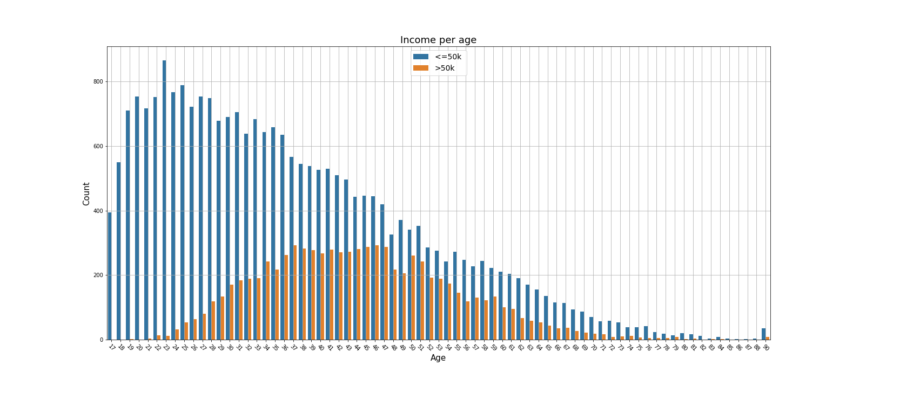

# Model evaluation challenge - US Income

# Description
The mission is *to predict the income of every US citizen*, using `RandomForestClassifier()` from `sklearn`.   
The dataset and Readme used can be found here (https://github.com/becodeorg/GNT-Arai-2.31/blob/master/content/additional_resources/datasets/US%20Income/README.md)

## Mission objectives

- Be able to analyze a machine learning problem
- Be able to reason about possible causes of overfitting
- Be able to remedy the causes of overfitting
- Be able to tune parameters of a machine learning model
- Be able to write clean and documented code.

# Installation

## Python version
* Python 3.9

## Packages used
* pandas
* numpy
* matplotlib.pyplot
* seaborn
* sklearn

# Usage
| File                | Description                                                    |
|---------------------|----------------------------------------------------------------|
| data_train.csv          | Input dataset to train the model|
| data_test.csv            | Extra dataset to test the model |
| /visuals            | Folder including the plots presented on the Readme |
| model-validation.ipynb       | Jupyter notebook used to work with the data |
| model-evaluation.py            | Final python code performing the model and the analysis |

# Results

Features of the dataset: 
[age, workclass, fnlwgt education, education-num, marital-status, occupation, relationship, race, sex, capital-gain, capital-loss, hours-per-week, native-country]	

## Data visualization
### Heatmap showing some correlations bettween the features on the dataset.

### Income related to age

### Income related to gender
We can see here that there is still a huge gap in income between male and female.

### Income related to race
From here we notice that mainly white people have income >50k.

## Baseline

Using the dataset (data_train.csv) as it is (after checking for NaNs and dropping duplicates), splitting it in 75% training and 25% test, using `RandomForestClassifier()` from `sklearn`, the metrics obtained are:

| Metrics                 | Score          |
|-----------------------|------------------|
|accuracy	| 0.86            |
|roc_auc_score	| 0.90            |
|matthews_corrcoef | 0.60            |
|MAE		| 0.14            |
|MQE		| 0.14            |
|R2		| 0.23            |
|Cross validation|            |

### Classification report

### Confusion matrix

### ROC curve

## First analysis

The data_train.csv includes 32516 measures. From those, 24720 are labeled as 0, meaning that the income is <=50k. For incomes >50k, labeled as 1, there are only 7841 point.
This is only 24% of the dataset. Thi shows us that the dataset is clearly unbalanced. This can explain the different scores obtained depending the metric we use.
For instance, we know that **accuracy** is sensible to unbalanced, and that **F1-score** (as combination of recall and precision) is not good either.

´Matthews_corrcoef´ or **Mathews Correlation Coefficient** or MCC can be better way to evaluate the model. It considers TP, TN, FP and FN.
If we trust this method to measure the performance of our model, a 0.6 score is not the best.

Considering all the above explained, we see that some work is needed to improve the performance of the model

# Contributors
| Name                  | Github                                 |
|-----------------------|----------------------------------------|
| Graciela Lopez Rosson | https://github.com/GracielaLopezRosson |
         

# Timeline
16-08-2021
